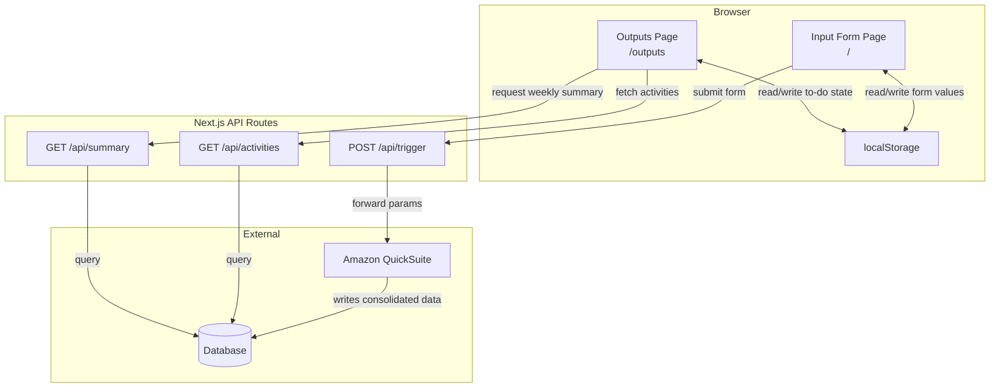

# Design Document: CSSM Activity Summarizer

## Overview

The CSSM Activity Summarizer is a Next.js browser-based application that consolidates workplace activity data from multiple tools (Slack, Outlook Email, Asana, SFDC, Tableau) via existing Amazon QuickSuite (AQS) integrations. The app provides two core pages:

1. An **Input Form** page where users enter site addresses, URLs, and email addresses to trigger AQS integrations
2. An **Outputs Page** that displays consolidated activity data grouped by source, with to-do list functionality, previous-day categorization (customer-facing vs internal), and an optional weekly summary

The app uses Next.js API routes as a thin proxy layer between the frontend and AQS/database. Browser localStorage handles form pre-population (with 24-hour expiry) and to-do item persistence.

### Key Design Decisions

- **Next.js App Router** with JavaScript (not TypeScript) — hackathon speed over type safety
- **API Routes** act as a pass-through to AQS and the database; no heavy server-side logic
- **localStorage** for client-side persistence (form values, to-do state) — no user auth needed
- **Classification heuristic** for Requirement 10 is rule-based and configurable, not ML-based
- **AQS integrations are external** — we don't build or modify them; we only trigger and consume

## Architecture



### Request Flow

1. User fills out the Input Form and submits
2. `POST /api/trigger` forwards parameters to AQS
3. AQS processes integrations and writes consolidated data to the database
4. User navigates to the Outputs Page
5. `GET /api/activities` queries the database and returns Activity Items
6. The Outputs Page renders activities grouped by source, with to-do checkboxes and a Previous Day Summary section
7. (Stretch) User clicks "Summarize my activity this week" → `GET /api/summary` returns a weekly summary

## Components and Interfaces

### Pages

#### `/` — Input Form Page
- Renders the `InputForm` component
- On mount: checks localStorage for form values less than 24 hours old; pre-populates if found
- On successful submit: stores form values + timestamp in localStorage, shows confirmation, provides link to Outputs Page

#### `/outputs` — Outputs Page
- Fetches activities from `GET /api/activities` on mount
- Renders `ActivityList`, `PreviousDaySummary`, `TodoList`, and optionally `WeeklySummary`
- Manages to-do completion state in localStorage

### UI Components

```
InputForm
├── FormField (site addresses) [required]
├── FormField (URLs) [required]
├── FormField (email addresses) [required]
├── FormField (SFDC URL) [optional]
├── FormField (Tableau URL) [optional]
├── ValidationMessage
├── SubmitButton (disabled while validation errors exist)
└── LoadingIndicator

OutputsPage
├── LoadingIndicator
├── ActivityCount (total count)
├── PreviousDaySummary
│   ├── CategoryGroup ("Customer-Facing")
│   │   └── ActivityItem[] (with count)
│   └── CategoryGroup ("Internal")
│       └── ActivityItem[] (with count)
├── ActivityList (grouped by source)
│   └── SourceGroup (Slack | Outlook Email | Asana | SFDC | Tableau)
│       └── TodoItem[]
│           ├── Checkbox
│           ├── ActivityContent
│           └── SourceLink
└── WeeklySummary (stretch)

Navigation
├── Link to Input Form
└── Link to Outputs Page
```

### API Routes

#### `POST /api/trigger`
- **Request Body:**
```json
{
  "siteAddresses": ["string"],
  "urls": ["string"],
  "emailAddresses": ["string"],
  "sfdcUrl": "string | null",
  "tableauUrl": "string | null"
}
```
- **Notes:** `sfdcUrl` and `tableauUrl` are optional. When null or omitted, the API route SHALL not trigger those integrations via AQS.
- **Success Response (200):**
```json
{
  "success": true,
  "message": "Integrations triggered successfully"
}
```
- **Error Response (502):**
```json
{
  "success": false,
  "error": "AQS failed to acknowledge the integration request"
}
```

#### `GET /api/activities`
- **Query Params:** none (fetches all consolidated data for the current context)
- **Success Response (200):**
```json
{
  "activities": [ActivityItem],
  "count": 42
}
```
- **Empty Response (200):**
```json
{
  "activities": [],
  "count": 0,
  "message": "No activity data available"
}
```
- **Error Response (500):**
```json
{
  "success": false,
  "error": "Database query failed"
}
```

#### `GET /api/summary` (Stretch)
- **Query Params:** `?range=week`
- **Success Response (200):**
```json
{
  "summary": { ... },
  "range": "week"
}
```

### Validation Module

A pure utility module (`lib/validation.js`) that exports validation functions:

```javascript
// lib/validation.js
export function validateUrl(value)        // returns { valid: boolean, error?: string }
export function validateEmail(value)      // returns { valid: boolean, error?: string }
export function validateRequired(value)   // returns { valid: boolean, error?: string }
export function validateForm(formData)    // returns { valid: boolean, errors: Record<string, string> }
```

### Activity Classification Module

A pure utility module (`lib/classification.js`) for Requirement 10:

```javascript
// lib/classification.js

const DEFAULT_RULES = [
  { source: 'sfdc', category: 'customer-facing' },
  { match: 'emailDomain', domains: [], category: 'customer-facing' },
  { match: 'mentionsCustomer', customerName: '', category: 'customer-facing' },
  // fallback: 'internal'
];

export function classifyActivity(activity, rules = DEFAULT_RULES)
// returns 'customer-facing' | 'internal'

export function categorizeActivities(activities, rules = DEFAULT_RULES)
// returns { customerFacing: ActivityItem[], internal: ActivityItem[] }

export function isFromPreviousDay(activity)
// returns boolean — checks if activity.date is the prior calendar day
```

**Classification heuristic (configurable via rules array):**
1. SFDC activities → customer-facing
2. Emails sent to a customer-designated domain → customer-facing
3. Activities not mentioning the customer name → internal
4. Fallback → internal

### localStorage Module

A pure utility module (`lib/storage.js`) for form pre-population and to-do persistence:

```javascript
// lib/storage.js
const FORM_KEY = 'cssm-form-data';
const TODO_KEY = 'cssm-todo-state';
const EXPIRY_MS = 24 * 60 * 60 * 1000; // 24 hours

export function saveFormData(formData)         // stores { data, timestamp }
export function loadFormData()                 // returns formData or null (if expired/missing)
export function isFormDataExpired(timestamp)   // returns boolean

export function saveTodoState(todoState)       // stores Map<activityId, boolean>
export function loadTodoState()                // returns Map or empty Map
```

## Data Models

### ActivityItem

```javascript
{
  id: "string",                    // unique identifier
  source: "slack" | "outlook" | "asana" | "sfdc" | "tableau",
  content: "string",              // display text / summary
  sourceUrl: "string",            // link to original source
  date: "string",                 // ISO 8601 date string
  metadata: {
    emailDomain: "string",        // for outlook items — recipient domain
    customerName: "string",       // extracted customer reference, if any
    // ... other source-specific metadata
  }
}
```

### FormData

```javascript
{
  siteAddresses: ["string"],
  urls: ["string"],
  emailAddresses: ["string"],
  sfdcUrl: "string" | null,       // optional
  tableauUrl: "string" | null     // optional
}
```

### StoredFormData (localStorage)

```javascript
{
  data: FormData,
  timestamp: number               // Date.now() at time of save
}
```

### TodoState (localStorage)

```javascript
{
  // Map of activity ID to completion status
  [activityId: string]: boolean
}
```

### ClassificationRule

```javascript
{
  source?: "string",              // match by integration source
  match?: "emailDomain" | "mentionsCustomer",
  domains?: ["string"],           // for emailDomain match
  customerName?: "string",        // for mentionsCustomer match
  category: "customer-facing" | "internal"
}
```

### WeeklySummary (Stretch)

```javascript
{
  range: { start: "string", end: "string" },  // ISO dates
  totalCount: number,
  bySource: {
    [source: string]: { count: number, items: [ActivityItem] }
  }
}
```

## Correctness Properties

*A property is a characteristic or behavior that should hold true across all valid executions of a system — essentially, a formal statement about what the system should do. Properties serve as the bridge between human-readable specifications and machine-verifiable correctness guarantees.*

### Property 1: URL validation correctness

*For any* string, `validateUrl` should return `{ valid: true }` if and only if the string is a well-formed URL (has a valid protocol, host, and structure), and `{ valid: false, error: string }` otherwise.

**Validates: Requirements 2.1**

### Property 2: Email validation correctness

*For any* string, `validateEmail` should return `{ valid: true }` if and only if the string is a well-formed email address (matches standard email format), and `{ valid: false, error: string }` otherwise.

**Validates: Requirements 2.2**

### Property 3: Form validation identifies missing required fields

*For any* combination of empty and non-empty form field values, `validateForm` should return errors for exactly the required fields that are empty (site addresses, URLs, email addresses), and should NOT return errors for empty optional fields (SFDC URL, Tableau URL). The set of error keys should equal the set of empty required field names.

**Validates: Requirements 1.5**

### Property 4: Form submission data integrity

*For any* valid form data (all required fields populated and passing validation, with optional SFDC/Tableau fields either populated or null), submitting the form should result in an API call whose payload is identical to the form data entered by the user, including null values for omitted optional fields.

**Validates: Requirements 1.4**

### Property 5: Activity item rendering completeness

*For any* ActivityItem with a non-empty content string, a valid source, and a valid sourceUrl, rendering that item should produce output containing the content text, the source label, and a link pointing to the sourceUrl that opens in a new tab.

**Validates: Requirements 5.1, 5.2**

### Property 6: Activity grouping by source

*For any* array of ActivityItems with mixed sources, grouping by source should produce groups where (a) every item in a group has the matching source, (b) every item from the input appears in exactly one group, and (c) the total count across all groups equals the input array length.

**Validates: Requirements 5.3, 5.4**

### Property 7: To-do check/uncheck round-trip

*For any* TodoItem, checking and then unchecking the item should restore it to its original uncompleted visual state.

**Validates: Requirements 6.3**

### Property 8: To-do state persistence round-trip

*For any* map of activity IDs to boolean completion states, saving the to-do state to localStorage and then loading it should return an equivalent map.

**Validates: Requirements 6.4**

### Property 9: Form data storage round-trip (within 24 hours)

*For any* valid form data, saving it via `saveFormData` and then calling `loadFormData` with a current time less than 24 hours after the save timestamp should return the original form data unchanged.

**Validates: Requirements 9.1, 9.2**

### Property 10: Form data expiry after 24 hours

*For any* timestamp that is more than 24 hours in the past, `isFormDataExpired(timestamp)` should return `true`, and `loadFormData` should return `null`.

**Validates: Requirements 9.3**

### Property 11: Previous day activity filtering

*For any* array of ActivityItems with dates spanning multiple days, `isFromPreviousDay` should return `true` only for items whose date falls on the prior calendar day relative to the current date, and `false` for all others.

**Validates: Requirements 10.1**

### Property 12: Activity categorization partitions correctly

*For any* array of ActivityItems and a valid set of classification rules, `categorizeActivities` should produce two groups ("customer-facing" and "internal") where (a) every input item appears in exactly one group, (b) no item appears in both groups, (c) the sum of group sizes equals the input array length, and (d) each item's group matches the result of `classifyActivity` for that item.

**Validates: Requirements 10.2, 10.3, 10.4**

## Error Handling

### Input Form Errors
- **Validation errors**: Displayed inline next to the offending field. Submit button remains disabled until all errors are resolved.
- **Network errors on submit**: Display a toast/banner message: "Failed to trigger integrations. Please try again." with a retry option.
- **AQS rejection (502 from API)**: Display the error message from the API response.

### Outputs Page Errors
- **Database query failure**: Display an error banner: "Unable to load activity data. Please try again later." with a retry button.
- **Empty data**: Display a friendly message: "No activity data available yet." — not an error state.
- **Weekly summary failure (stretch)**: Display inline error in the summary section without affecting the rest of the page.

### localStorage Errors
- **localStorage unavailable** (e.g., private browsing, quota exceeded): Gracefully degrade — form pre-population and to-do persistence simply don't work. No error shown to user; features silently fall back to stateless behavior.
- **Corrupted data**: If JSON parsing fails on load, clear the corrupted key and return default (empty) state.

### API Route Error Handling
- All API routes return structured JSON error responses with appropriate HTTP status codes.
- API routes should catch exceptions and never expose stack traces to the client.
- Timeout handling: API routes should set reasonable timeouts for AQS and database calls (e.g., 30 seconds) and return a timeout error if exceeded.

## Testing Strategy

### Property-Based Tests (fast-check)

Use [fast-check](https://github.com/dubzzz/fast-check) as the property-based testing library for JavaScript/Next.js.

Each property test must:
- Run a minimum of 100 iterations
- Reference the design property it validates via a tag comment
- Tag format: `Feature: cssm-activity-summarizer, Property {number}: {title}`

**Property tests cover:**
| Property | Module Under Test | What Varies |
|----------|------------------|-------------|
| 1: URL validation | `lib/validation.js` | Random strings, valid/invalid URLs |
| 2: Email validation | `lib/validation.js` | Random strings, valid/invalid emails |
| 3: Form validation missing fields | `lib/validation.js` | Random subsets of empty fields |
| 4: Form submission data integrity | `InputForm` component | Random valid form data |
| 5: Activity rendering completeness | `ActivityItem` component | Random ActivityItem objects |
| 6: Activity grouping by source | `lib/grouping.js` or inline | Random ActivityItem arrays |
| 7: To-do check/uncheck round-trip | `TodoItem` component | Random TodoItems |
| 8: To-do state persistence | `lib/storage.js` | Random ID→boolean maps |
| 9: Form data storage round-trip | `lib/storage.js` | Random form data |
| 10: Form data expiry | `lib/storage.js` | Random timestamps > 24h ago |
| 11: Previous day filtering | `lib/classification.js` | Random dates across multiple days |
| 12: Activity categorization | `lib/classification.js` | Random ActivityItems + rules |

### Unit Tests (Jest)

Example-based tests for specific scenarios and edge cases:
- Form renders with correct fields including optional SFDC and Tableau fields (1.1, 1.2)
- Optional fields do not trigger validation errors when empty (1.6)
- Validation error messages display at field level (2.3)
- Submit button disabled during validation errors (2.4)
- Confirmation message after successful trigger (3.4)
- Empty database result shows "no data" message (4.3)
- Database failure shows error message (4.4)
- To-do checkbox renders for each item (6.1)
- Checking a to-do visually marks it complete (6.2)
- Loading indicators appear during API calls (7.1, 7.2)
- Navigation link to outputs after success (7.3)
- Pre-populated fields are editable (9.4)
- Weekly summary button triggers API call (11.1)
- Weekly summary renders in separate section (11.3)

### Integration Tests

- `POST /api/trigger` forwards to AQS and returns correct responses (3.1, 3.2, 3.3)
- `GET /api/activities` queries database and returns data (4.1, 4.2)
- `GET /api/summary` returns weekly summary (11.2)

### Smoke Tests

- Navigation between pages works (8.1)
- Root URL renders Input Form (8.2)
