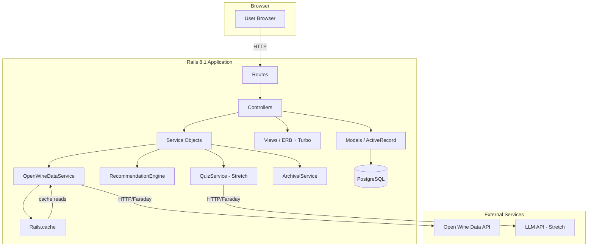
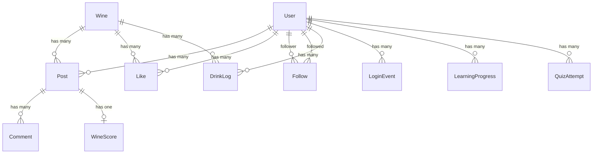

# Design Document: WynTaste Rails Modernization

## Overview

This design describes the modernization of the WynTaste wine review application from Rails 4.2.6 / Ruby 2.x to Rails 8.1 / Ruby 3.4. The existing app has four core models (User, Wine, Post, Comment) with basic CRUD, session-based auth, and Paperclip image uploads. The modernized app will be a fresh Rails 8.1 project targeting the same domain but adopting modern conventions (Propshaft, Importmap, ApplicationRecord, ActiveStorage) and adding significant new features: likes, follows, a recommendation engine, professional wine scoring, Open Wine Data API integration, usage analytics, user archival, and an optional LLM-powered quiz.

The application starts with a fresh empty PostgreSQL database — no data migration is needed. The existing code serves as a reference for domain logic and relationships only.

### Key Design Decisions

1. **Fresh Rails 8.1 project** — Generate a new app rather than in-place upgrade. The old codebase has too many deprecated patterns (Sprockets, Paperclip, CoffeeScript, manual routes, `ActiveRecord::Base` inheritance) to upgrade incrementally.
2. **Server-rendered HTML with Turbo** — Keep the app as a traditional Rails MVC app using Hotwire/Turbo for snappy page transitions. No SPA framework.
3. **Propshaft + Importmap** — Default Rails 8 asset pipeline. No webpack/esbuild.
4. **ActiveStorage for uploads** — Replaces Paperclip. Local disk storage in development, configurable for cloud in production.
5. **Session-based auth (hand-rolled)** — Preserve the existing `has_secure_password` + session cookie approach. No Devise. Rails 8.1's built-in `Authentication` generator could be used as a starting point.
6. **Open Wine Data API via HTTP client** — Use `Faraday` gem for external API calls with caching via `Rails.cache` (backed by `solid_cache`).
7. **LLM integration (stretch)** — Abstracted behind a service object with a fallback to static questions.
8. **Recommendation engine** — Pure Ruby/SQL collaborative filtering based on varietal/origin overlap. No external ML service.

## Architecture

### High-Level Architecture



### Application Layers

1. **Routing Layer** — RESTful resource routes via `config/routes.rb`
2. **Controller Layer** — Thin controllers delegating to models and service objects
3. **Model Layer** — ActiveRecord models with validations, associations, scopes
4. **Service Layer** — `app/services/` for external API integration, recommendations, archival, quiz logic
5. **View Layer** — ERB templates with Turbo Frames/Streams for partial updates
6. **Job Layer** — `ActiveJob` for background tasks (cache warming, archival)

## Components and Interfaces

### Controllers

| Controller | Actions | Notes |
|---|---|---|
| `UsersController` | index, show, new, create, edit, update | Profile page (show) displays posts, likes, followers/following, learning progress |
| `SessionsController` | new, create, destroy | Login/logout. Records login events for analytics |
| `WinesController` | index, show, new, create, edit, update, destroy | Show page integrates Open Wine Data. Browse by varietal/origin |
| `PostsController` | index, show, new, create, edit, update, destroy | Owner-only edit/delete. Creates DrinkLog on post creation |
| `CommentsController` | create, destroy | Nested under posts |
| `LikesController` | create, destroy | Toggle like/unlike on wines |
| `FollowsController` | create, destroy | Follow/unfollow users |
| `FeedController` | index | Posts from followed users |
| `FavoritesController` | index | Current user's liked wines |
| `RecommendationsController` | index | Wine recommendations for current user |
| `LearningPathsController` | index, show | Learning progression with Open Wine Data |
| `QuizzesController` | new, create, show | Stretch goal — LLM quiz |
| `Admin::AnalyticsController` | index, drink_logs, login_events, user_activity | Developer-facing dashboards |
| `Admin::ArchivalsController` | index, create, restore | Archive/restore inactive users |

### Service Objects

| Service | Responsibility |
|---|---|
| `OpenWineDataService` | Fetches and caches wine data from Open Wine Data API. Returns enrichment hash or nil on failure. |
| `RecommendationEngine` | Computes wine recommendations based on user's reviewed/liked varietals and origins. Pure SQL + Ruby. |
| `WineScoreCalculator` | Calculates weighted professional score from sub-scores. Pure function. |
| `QuizService` | Generates quiz questions via LLM API with static fallback. Calculates score and expertise level. |
| `ArchivalService` | Moves inactive users to `archived_users` table, preserves content, handles restore. |
| `UsageTracker` | Records login events, post creation events. Provides aggregate query methods. |

### Authentication & Authorization Concerns

```ruby
# app/controllers/concerns/authentication.rb
module Authentication
  extend ActiveSupport::Concern

  included do
    helper_method :current_user, :logged_in?
    before_action :require_login
  end

  def current_user
    @current_user ||= User.find_by(id: session[:user_id])
  end

  def logged_in?
    current_user.present?
  end

  def require_login
    unless logged_in?
      flash[:alert] = "You must be logged in."
      redirect_to login_path
    end
  end
end

# app/controllers/concerns/authorization.rb
module Authorization
  extend ActiveSupport::Concern

  def authorize_owner!(resource)
    unless resource.user_id == current_user.id
      flash[:alert] = "You are not authorized to perform this action."
      redirect_to resource
    end
  end
end
```

### Open Wine Data Integration

```ruby
# app/services/open_wine_data_service.rb
class OpenWineDataService
  BASE_URL = "https://api.openwinedata.org/v1"

  def initialize(client: Faraday.new(url: BASE_URL))
    @client = client
  end

  def enrich_wine(varietal:, origin:)
    cache_key = "owd:#{varietal}:#{origin}"
    Rails.cache.fetch(cache_key, expires_in: 24.hours) do
      fetch_enrichment(varietal, origin)
    end
  rescue Faraday::Error => e
    Rails.logger.warn("Open Wine Data API error: #{e.message}")
    nil  # graceful fallback
  end

  private

  def fetch_enrichment(varietal, origin)
    response = @client.get("wines", { varietal: varietal, origin: origin })
    return nil unless response.success?
    JSON.parse(response.body, symbolize_names: true)
  end
end
```

### Recommendation Engine

```ruby
# app/services/recommendation_engine.rb
class RecommendationEngine
  def initialize(user)
    @user = user
  end

  def recommend(limit: 10)
    preferred_varietals = user_preferred_varietals
    preferred_origins = user_preferred_origins
    return Wine.none if preferred_varietals.empty? && preferred_origins.empty?

    reviewed_wine_ids = @user.posts.pluck(:wine_id) + @user.liked_wines.pluck(:id)

    Wine.where.not(id: reviewed_wine_ids)
        .where(varietal: preferred_varietals)
        .or(Wine.where.not(id: reviewed_wine_ids).where(origin: preferred_origins))
        .distinct
        .limit(limit)
  end

  private

  def user_preferred_varietals
    Wine.joins(:posts).where(posts: { user_id: @user.id }).pluck(:varietal).uniq +
      @user.liked_wines.pluck(:varietal).uniq
  end

  def user_preferred_origins
    Wine.joins(:posts).where(posts: { user_id: @user.id }).pluck(:origin).uniq +
      @user.liked_wines.pluck(:origin).uniq
  end
end
```

### Wine Score Calculator

```ruby
# app/services/wine_score_calculator.rb
class WineScoreCalculator
  WEIGHTS = {
    appearance: 0.15,
    nose: 0.25,
    palate: 0.35,
    overall_impression: 0.25
  }.freeze

  RANGES = {
    appearance: 5..10,
    nose: 10..25,
    palate: 15..35,
    overall_impression: 10..30
  }.freeze

  def self.calculate(sub_scores)
    new(sub_scores).calculate
  end

  def initialize(sub_scores)
    @sub_scores = sub_scores.symbolize_keys.slice(*WEIGHTS.keys)
  end

  def calculate
    validate!
    # Normalize each sub-score to 0-1 range, apply weight, scale to 50-100
    weighted_sum = WEIGHTS.sum do |component, weight|
      range = RANGES[component]
      normalized = (@sub_scores[component].to_f - range.min) / (range.max - range.min)
      normalized * weight
    end
    (50 + (weighted_sum * 50)).round
  end

  def valid?
    RANGES.all? do |component, range|
      value = @sub_scores[component]
      value.present? && range.cover?(value.to_i)
    end
  end

  private

  def validate!
    raise ArgumentError, "Invalid sub-scores" unless valid?
  end
end
```

## Data Models

### Entity Relationship Diagram



### Models and Attributes

#### User
| Attribute | Type | Constraints |
|---|---|---|
| id | bigint | PK |
| first_name | string | required |
| last_name | string | required |
| email | string | required, unique (case-insensitive) |
| password_digest | string | required (bcrypt) |
| expertise_level | string | enum: beginner/intermediate/advanced, default: beginner |
| last_login_at | datetime | nullable |
| created_at | datetime | |
| updated_at | datetime | |

Associations: `has_many :posts`, `has_many :wines, through: :posts`, `has_many :likes`, `has_many :liked_wines, through: :likes, source: :wine`, `has_many :active_follows, class_name: "Follow", foreign_key: :follower_id`, `has_many :following, through: :active_follows, source: :followed`, `has_many :passive_follows, class_name: "Follow", foreign_key: :followed_id`, `has_many :followers, through: :passive_follows, source: :follower`, `has_many :drink_logs`, `has_many :login_events`, `has_many :learning_progresses`, `has_many :quiz_attempts`

#### Wine
| Attribute | Type | Constraints |
|---|---|---|
| id | bigint | PK |
| name | string | required |
| varietal | string | |
| vintage | integer | |
| origin | string | |
| description | text | |
| created_at | datetime | |
| updated_at | datetime | |

Associations: `has_many :posts`, `has_many :users, through: :posts`, `has_many :likes`, `has_many :liking_users, through: :likes, source: :user`, `has_many :drink_logs`

#### Post
| Attribute | Type | Constraints |
|---|---|---|
| id | bigint | PK |
| title | string | required |
| text | text | required |
| rating | integer | optional (1-5 quick rate) |
| user_id | bigint | FK → users |
| wine_id | bigint | FK → wines |
| created_at | datetime | |
| updated_at | datetime | |

Associations: `belongs_to :user`, `belongs_to :wine`, `has_many :comments, dependent: :destroy`, `has_one :wine_score, dependent: :destroy`, `has_one_attached :image`

#### Comment
| Attribute | Type | Constraints |
|---|---|---|
| id | bigint | PK |
| commenter | string | required |
| body | text | required |
| post_id | bigint | FK → posts |
| created_at | datetime | |
| updated_at | datetime | |

Associations: `belongs_to :post`

#### Like
| Attribute | Type | Constraints |
|---|---|---|
| id | bigint | PK |
| user_id | bigint | FK → users |
| wine_id | bigint | FK → wines |
| created_at | datetime | |

Constraints: unique index on `[user_id, wine_id]`
Associations: `belongs_to :user`, `belongs_to :wine`

#### Follow
| Attribute | Type | Constraints |
|---|---|---|
| id | bigint | PK |
| follower_id | bigint | FK → users |
| followed_id | bigint | FK → users |
| created_at | datetime | |

Constraints: unique index on `[follower_id, followed_id]`, check constraint `follower_id != followed_id`
Associations: `belongs_to :follower, class_name: "User"`, `belongs_to :followed, class_name: "User"`

#### WineScore
| Attribute | Type | Constraints |
|---|---|---|
| id | bigint | PK |
| post_id | bigint | FK → posts |
| appearance | integer | 5–10 |
| nose | integer | 10–25 |
| palate | integer | 15–35 |
| overall_impression | integer | 10–30 |
| total_score | integer | 50–100 (calculated) |
| created_at | datetime | |
| updated_at | datetime | |

Associations: `belongs_to :post`

#### DrinkLog
| Attribute | Type | Constraints |
|---|---|---|
| id | bigint | PK |
| user_id | bigint | FK → users |
| wine_id | bigint | FK → wines |
| logged_at | datetime | required |
| created_at | datetime | |

Associations: `belongs_to :user`, `belongs_to :wine`

#### LoginEvent
| Attribute | Type | Constraints |
|---|---|---|
| id | bigint | PK |
| user_id | bigint | FK → users |
| logged_in_at | datetime | required |

Associations: `belongs_to :user`

#### LearningProgress
| Attribute | Type | Constraints |
|---|---|---|
| id | bigint | PK |
| user_id | bigint | FK → users |
| varietal | string | required |
| completed_at | datetime | required |
| created_at | datetime | |

Constraints: unique index on `[user_id, varietal]`
Associations: `belongs_to :user`

#### QuizAttempt (Stretch)
| Attribute | Type | Constraints |
|---|---|---|
| id | bigint | PK |
| user_id | bigint | FK → users |
| questions | jsonb | required |
| answers | jsonb | required |
| score | integer | required |
| expertise_level | string | required |
| created_at | datetime | |

Associations: `belongs_to :user`

#### ArchivedUser
| Attribute | Type | Constraints |
|---|---|---|
| id | bigint | PK |
| original_user_id | bigint | required |
| first_name | string | |
| last_name | string | |
| email | string | |
| password_digest | string | |
| expertise_level | string | |
| last_login_at | datetime | |
| archived_at | datetime | required |
| original_created_at | datetime | |

#### ArchivalLog
| Attribute | Type | Constraints |
|---|---|---|
| id | bigint | PK |
| user_id | bigint | required |
| action | string | required (archive/restore) |
| performed_at | datetime | required |
| created_at | datetime | |


## Correctness Properties

*A property is a characteristic or behavior that should hold true across all valid executions of a system — essentially, a formal statement about what the system should do. Properties serve as the bridge between human-readable specifications and machine-verifiable correctness guarantees.*

### Property 1: Case-insensitive email uniqueness

*For any* two User registration attempts where the email addresses differ only in letter casing, the second registration SHALL be rejected and the first User record SHALL remain unchanged.

**Validates: Requirements 2.3**

### Property 2: Password minimum length enforcement

*For any* string shorter than 5 characters used as a password during User registration, the registration SHALL be rejected. *For any* string of 5 or more characters, the password length validation SHALL pass.

**Validates: Requirements 2.4**

### Property 3: Unauthenticated request redirect

*For any* controller action that requires authentication, when no valid session exists, the application SHALL redirect to the login page.

**Validates: Requirements 3.5**

### Property 4: CSRF authenticity token presence

*For any* HTML page rendered by the application that contains a form element, that form SHALL include a hidden field with an authenticity token.

**Validates: Requirements 4.2**

### Property 5: Image content type validation

*For any* content type string attached to a Post image, the attachment SHALL be accepted if and only if the content type is one of image/jpeg, image/png, or image/gif.

**Validates: Requirements 6.7**

### Property 6: Post listing order invariant

*For any* set of Post records, the post index SHALL return them ordered by created_at descending — that is, for every consecutive pair of posts in the listing, the earlier post's created_at SHALL be greater than or equal to the later post's created_at.

**Validates: Requirements 6.9**

### Property 7: Owner-only post mutation

*For any* logged-in User and any Post, the application SHALL permit edit and delete operations if and only if the User is the Post's owner (user_id matches). Non-owners SHALL be redirected with an authorization error.

**Validates: Requirements 8.1, 8.2, 8.3**

### Property 8: Multiple validation errors preservation

*For any* User registration attempt with multiple invalid attributes, the rendered response SHALL contain a distinct error message for each invalid attribute — no message SHALL overwrite another.

**Validates: Requirements 10.1**

### Property 9: DrinkLog creation on post creation

*For any* successfully created Post, a corresponding DrinkLog record SHALL exist with matching user_id, wine_id, and a logged_at timestamp within the same second as the Post's created_at.

**Validates: Requirements 11.1**

### Property 10: Drinking history ordering

*For any* User's drinking history listing, the entries SHALL be ordered by logged_at descending — each entry's timestamp SHALL be greater than or equal to the next entry's timestamp.

**Validates: Requirements 11.3**

### Property 11: Wine popularity ranking

*For any* set of Wines with Posts, the popularity ranking SHALL order wines by descending Post count — a wine with more posts SHALL never appear below a wine with fewer posts.

**Validates: Requirements 11.4**

### Property 12: Like uniqueness constraint

*For any* User and Wine, attempting to create a second Like for the same (user_id, wine_id) pair SHALL be rejected, and the total Like count for that pair SHALL remain exactly 1.

**Validates: Requirements 12.3**

### Property 13: Wine filtering correctness

*For any* varietal or origin filter applied to the Wine catalog, every Wine in the result set SHALL match the specified filter value, and no Wine matching the filter SHALL be excluded from the result set.

**Validates: Requirements 13.3**

### Property 14: Feed content and ordering

*For any* User viewing their feed, every Post in the feed SHALL belong to a User that the viewer follows, and no Post from a followed User SHALL be missing. Posts SHALL be ordered by created_at descending.

**Validates: Requirements 14.3**

### Property 15: Follower and following count accuracy

*For any* User profile, the displayed follower count SHALL equal the number of Follow records where that User is the followed, and the following count SHALL equal the number of Follow records where that User is the follower.

**Validates: Requirements 14.5**

### Property 16: Recommendation relevance and exclusion

*For any* User with review or like history, every recommended Wine SHALL share at least one varietal or origin with the User's reviewed or liked Wines, AND no recommended Wine SHALL appear in the User's already-reviewed or already-liked set.

**Validates: Requirements 15.1, 15.2**

### Property 17: Pagination size invariant

*For any* paginated data listing, each page SHALL contain at most 25 records, and the sum of records across all pages SHALL equal the total record count.

**Validates: Requirements 16.3**

### Property 18: Login event recording

*For any* successful login, a LoginEvent record SHALL be created with the correct user_id and a logged_in_at timestamp within the same second as the login action.

**Validates: Requirements 17.1**

### Property 19: Post creation event recording

*For any* successfully created Post, a corresponding event record (DrinkLog) SHALL exist capturing the user_id, wine_id, and timestamp.

**Validates: Requirements 17.2**

### Property 20: Quiz score calculation

*For any* set of quiz answers where each answer is either correct or incorrect, the calculated score SHALL equal the number of correct answers divided by the total number of questions, expressed as a percentage.

**Validates: Requirements 18.4**

### Property 21: Expertise level assignment

*For any* quiz score in the range 0–100, the assigned expertise level SHALL be deterministic: Beginner for scores below the intermediate threshold, Intermediate for scores between the intermediate and advanced thresholds, and Advanced for scores at or above the advanced threshold.

**Validates: Requirements 18.5**

### Property 22: Learning path completion marking

*For any* User who has created a Post reviewing a Wine whose varietal matches a step in the learning path, that varietal step SHALL be marked as completed for that User.

**Validates: Requirements 19.3**

### Property 23: Next varietal suggestion

*For any* User with partial learning path progress, the suggested next varietal SHALL be the first varietal in the learning path sequence that the User has not yet completed.

**Validates: Requirements 19.5**

### Property 24: Inactive user archival

*For any* User whose last_login_at is older than the configured inactivity threshold (default 180 days), after running the archival operation, that User SHALL exist in the archived_users table and SHALL NOT exist in the users table.

**Validates: Requirements 20.1, 20.2**

### Property 25: Archived user content preservation

*For any* archived User who had Posts and Comments, after archival those Posts and Comments SHALL still exist in the database, and the displayed author name SHALL be "Archived User".

**Validates: Requirements 20.3**

### Property 26: Archived user login prevention

*For any* archived User, attempting to authenticate with their original email and password SHALL fail.

**Validates: Requirements 20.4**

### Property 27: Wine score weighted calculation

*For any* set of valid sub-scores (Appearance in 5–10, Nose in 10–25, Palate in 15–35, Overall Impression in 10–30), the calculated total score SHALL equal the weighted sum formula: 50 + ((normalized_appearance × 0.15 + normalized_nose × 0.25 + normalized_palate × 0.35 + normalized_overall × 0.25) × 50), rounded to the nearest integer, and SHALL fall within 50–100.

**Validates: Requirements 21.3, 21.1**

### Property 28: Sub-score range validation

*For any* integer value provided as a sub-score, the validation SHALL accept the value if and only if it falls within the defined range for that component (Appearance: 5–10, Nose: 10–25, Palate: 15–35, Overall Impression: 10–30).

**Validates: Requirements 21.4**

## Error Handling

### External API Failures

| Scenario | Behavior |
|---|---|
| Open Wine Data API timeout/error | `OpenWineDataService` returns `nil`. Views check for `nil` and display only local wine data. Cached data continues to serve if available. |
| LLM API timeout/error (stretch) | `QuizService` falls back to static question bank stored in `db/seeds` or a YAML file. |
| Database connection failure | Standard Rails error pages (500). ActiveRecord connection pool handles retries. |

### Validation Errors

- All model validations use ActiveModel::Errors. Controllers re-render forms with `@resource.errors.full_messages`.
- The old bug where `flash[:notice]` was overwritten is fixed by using `@user.errors` directly instead of flash for validation messages.
- Flash messages are used only for success notices and authorization alerts.

### Authentication/Authorization Errors

- Unauthenticated access → redirect to login with `flash[:alert]`
- Unauthorized post mutation → redirect to post show with `flash[:alert]`
- Archived user login attempt → same "invalid email or password" message (no information leakage)

### Data Integrity

- Database-level constraints (foreign keys, unique indexes, NOT NULL) as safety net behind model validations.
- `Like` uniqueness enforced at both model (`validates_uniqueness_of`) and database (unique index) levels.
- `Follow` self-follow prevented by database check constraint and model validation.
- Archival uses a database transaction to ensure atomicity of user move + content update.

## Testing Strategy

### Testing Framework

- **Minitest** (Rails default) for unit and integration tests
- **Rantly** gem for property-based testing in Ruby
- Minimum **100 iterations** per property test

### Property-Based Tests

Each correctness property (1–28) will be implemented as a property-based test using Rantly. Tests will be tagged with comments referencing the design property:

```ruby
# Feature: rails-modernization, Property 27: Wine score weighted calculation
property_of { ... }.check(100) { |sub_scores| ... }
```

Key property test areas:
- **Pure functions**: WineScoreCalculator (Properties 27, 28), quiz score calculation (Property 20), expertise level assignment (Property 21)
- **Model validations**: email uniqueness (Property 1), password length (Property 2), image content type (Property 5), like uniqueness (Property 12), sub-score ranges (Property 28)
- **Query logic**: post ordering (Property 6), feed filtering/ordering (Property 14), wine filtering (Property 13), recommendations (Property 16), popularity ranking (Property 11), pagination (Property 17)
- **Authorization**: owner-only mutation (Property 7), unauthenticated redirect (Property 3)
- **Side effects**: DrinkLog creation (Property 9), login event recording (Property 18)
- **Archival logic**: inactive classification (Property 24), content preservation (Property 25), login prevention (Property 26)

### Unit Tests (Example-Based)

Focus on specific scenarios not covered by properties:
- Successful registration flow (2.5)
- Login/logout flows (3.1, 3.2, 3.3)
- CRUD happy paths for Wine, Post, Comment
- Flash message display (10.2, 10.3, 10.4)
- Like/unlike toggle (12.1, 12.2, 12.4)
- Follow/unfollow (14.1, 14.2)
- Open Wine Data caching (13.6)
- LLM fallback to static questions (18.8)
- Archival restore (20.5)
- Archival logging (20.6)

### Integration Tests

- Full request/response cycle tests for each controller action
- Authentication flow end-to-end
- Open Wine Data API integration with WebMock/VCR for HTTP stubbing
- ActiveStorage image upload flow

### Test Organization

```
test/
├── models/          # Model unit tests + property tests
├── services/        # Service object tests (WineScoreCalculator, RecommendationEngine, etc.)
├── controllers/     # Controller tests
├── integration/     # Full request cycle tests
├── properties/      # Property-based tests organized by domain
│   ├── user_properties_test.rb
│   ├── post_properties_test.rb
│   ├── wine_score_properties_test.rb
│   ├── recommendation_properties_test.rb
│   ├── archival_properties_test.rb
│   └── feed_properties_test.rb
└── test_helper.rb
```
